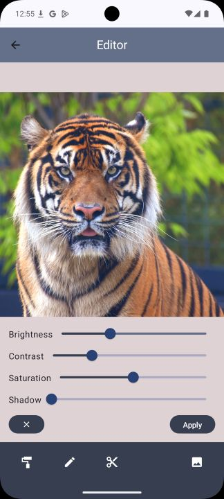

# Photo Edtior (Android)
Developed as part of the EBC-VA1 - Application Development for Android 1 course, the application is used for storing photos in the cloud and editing them.

The user interface displays an overview of all the photos the user has added – these images are stored in remote storage.
For each photo, it is possible to edit the title, date taken, description, and ISO value.

The application also offers tools for adjusting photo properties such as brightness, contrast, saturation, and shadows. Photos can also be cropped.

Each edited version is saved as a new photo and uploaded again to the remote storage.

## What i learned 
- Adopted MVVM architecture with Dependency Injection using Hilt
- Built UI with Jetpack Compose, incorporating material design
- Room for SQLite database persistence and DataStore for small value persistence
- Handling media input from camera and gallery, processing those inputs
- Storage for to upload and manage images
- Real-time image editing using OpenCV

## UserExperience
## Editing

## Crop

#Screenshots

## Home

## Storage

## Edit data

## Editor

## Crop

